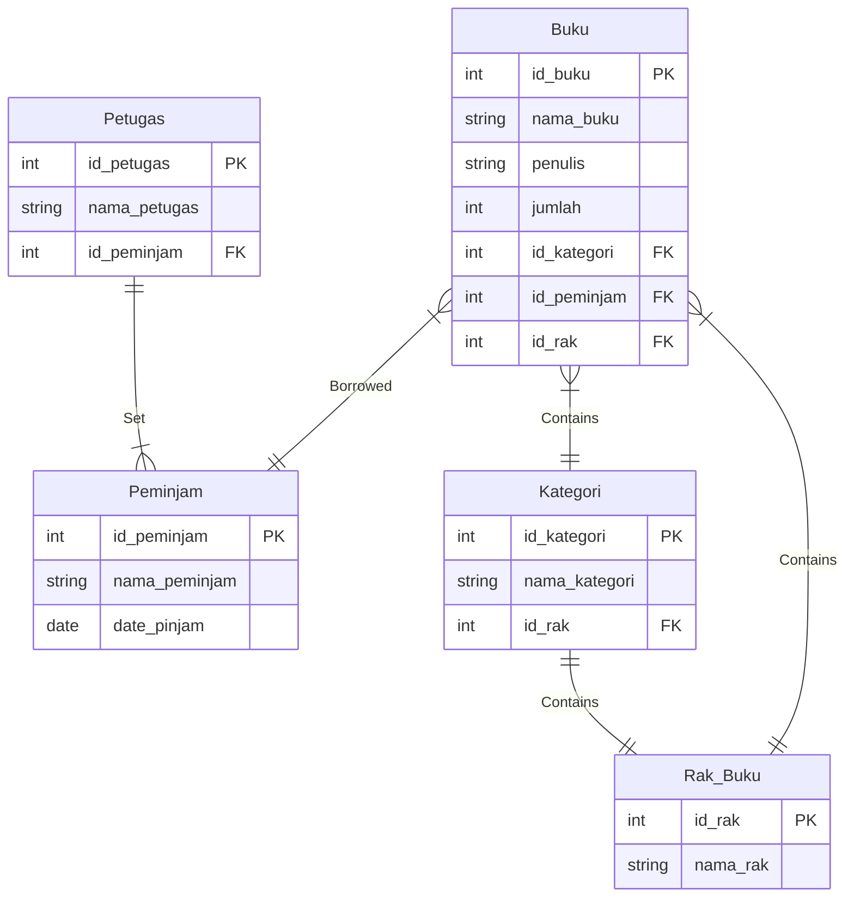

```mermaid
	erDiagram

	Buku }|--|| Peminjam : Borrowed
	Buku }|--|| Kategori : Contains
	Kategori ||--|| Rak_Buku : Contains
	Rak_Buku ||--|{ Buku : Contains
	Petugas ||--|{ Peminjam : Set

	Buku {
		int id_buku PK
		string nama_buku
		string penulis
		int jumlah
		int id_kategori FK
		int id_peminjam FK
		int id_rak FK
	}

	Kategori {
		int id_kategori PK
		string nama_kategori
		int id_rak FK
	}

	Rak_Buku {
		int id_rak PK
		string nama_rak
	}

	Petugas {
		int id_petugas PK
		string nama_petugas
		int id_peminjam FK
	}

	Peminjam {
		int id_peminjam PK
		string nama_peminjam
		date date_pinjam
	}

```